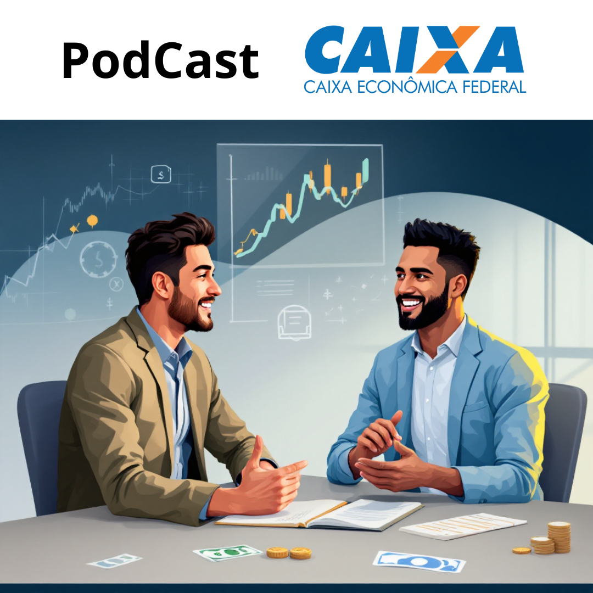

-------

# Projeto Podcast  Gerado por I.A.s

 > ℹ️ **NOTE:** Este é o repositório desenvolvido durante o curso no qual fui instrutor técnico na plataforma da [DIO](https://dio.me)

Projeto com o objetivo de gerar um podcast com as facilidades das ferramentas de IA. todos os prompts
seguem abaixo.

<a href="https://github.com/AFVELOSO13/podcast-prompt/blob/main/output/PodcastEditado.mp3" title="View PodCast now"> 📕Clique aqui para Ouvir</a>

## 💻 Tecnologias utilizadas no projeto

- [ChatGPT](https://chat.openai.com/) 
- [ChatGPT 4o Mini](https://chat.openai.com/)
- [Editor de aúdio](https://www.capcut.com/editor?from_page=landing_page&__action_from=picture_V%C3%ADdeos+profissionais+em+minutos%2C+n%C3%A3o+em+horas.&scenario=custom)

## 🧠 Prompts

ChatGPT：

|   Ação   | prompt                                                                                                                                                                                                                                                                         |
| :------: | ------------------------------------------------------------------------------------------------------------------------------------------------------------------------------------------------------------------------------------------------------------------------------ |
|  título  | Gerar um podcast de finanças focado em investimentos da caixa Econômica Federal.                                                        |
| conteúdo | Você é um roteirista de podcast e vamos criar um roteiro de podcast de finanças focado em investimentos da caixa Econômica Federal. O título do podcast é " Tesouro de Oportunidades" e o subtítulo é " Explorando Investimentos da Caixa Econômica " O público alvo é para todo cliente e possível cliente em potencial que tenha uma reserva financeira e gostaria de rentabilizar seu dinheiro.
O formato do roteiro deve ser:
{ INTRODUÇÃO }
{ CURIOSIDADE }
{ CURIOSIDADE }
{ FINALIZAÇÃO }
{ REGRAS }
No bloco { INTRODUÇÃO } substitua por uma introdução igual as introduções dos vídeos do canal do “ PRIMO RICO”
No bloco { CURIOSIDADE } substitua por uma curiosidade relacionada a investimentos de LCI da Caixa Econômica Federal.
No bloco { CURIOSIDADE } substitua por uma ferramenta utilizada para avaliar aplicações
No bloco { FINALIZAÇÃO } substitua por uma despedida com o final “ Eu sou Alexandre, funcionário da Caixa Econômica Federal e esse foi o podcast " Tesouro de Oportunidades"
Use termos de fácil explicação
O podcast vai ser apresentado somente por uma pessoa chamada Alexandre.
O podcast deve ser curto
{ REGRAS NEGATIVAS }
Não use muitos termos técnicos.
Não ultrapasse 5 minutos |

ChatGPT 4o Mini：

|  Ação  | prompt                                                                                 |
| :----: | -------------------------------------------------------------------------------------- |
| título | Faça uma capa para um podcast simulando um atendimento de um cliente e um funcionário da Caixa Economica federal o qual ele oferece produtos de investimentos |

## ✨ Features

- Conteúdo gerado via ChatGPT
- Imagens geradas via ChatGPT 4o Mini

## 📚 Materiais

- Imagens utilizadas em `assets`
- Podcats gerado durante as aulas em `output`

## 👨‍💻 Expert

 
   Alexandre F. F. Veloso 
   <a href="https://github.com/AFVELOSO13">GitHub</a>

---

⌨️ com 💜 por [Alexandre F. F. Veloso](https://github.com/AFVELOSO13)
